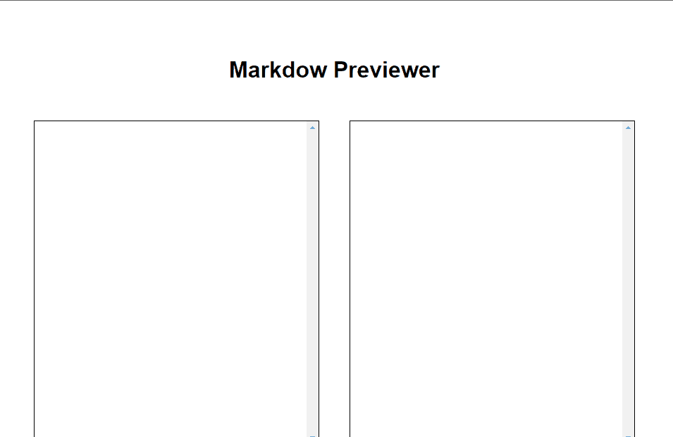

<h1 align="center">Markdown Previewer</h1>
<p align="center">🚀 Aplicação feita pra converter MD em HTML </p>

<div align="center">
  
  
  
  
</div>

<p align="center">
 <a href="#objetivo">Objetivo</a> •
 <a href="#funcionalidades">Funcionalidades</a> • 
 <a href="#pre-req">Pré-requisitos</a> • 
 <a href="#tecnologias">Tecnologias</a> • 
 <a href="#autor">Autor</a> • 
 <a href="#license">License</a>
</p>
<h4 align="center"> 
	🚧  Markdown Previewer 📝 Concluído.  🚧
</h4>


<h1 id="objetivo">Objetivo 🎯</h1>
Montar um aplicação que converta Git Flavoured Markdown ou Markdown em HTML.

<h1 id="funcionalidades">Funcionalidades</h1>

- [x] Textarea onde o usuário vai colocar os markdowns
- [x] Cada mudança que tem neste textarea vai acontecer ao mesmo tempo no
      container do lado direito em formato HTML
    
    


<div align="center">
  
</div>


<h1 id="pre-req">Pré-requisitos</h1>

Antes de começar, você vai precisar ter instalado em sua máquina o
[Git](https://git-scm.com). Além disto é bom ter um editor para trabalhar com o código como [VSCode](https://code.visualstudio.com/)

💡O Frontend necessita que o Backend esteja sendo executado para funcionar.

### 🎲 Rodando o projeto na sua máquina

```bash
# Clone este repositório
$ git clone https://github.com/davivsouza/markdown-previewer.git

# Acesse a pasta do projeto no terminal/cmd
$ cd markdown-previewer

# Instale as dependências
$ npm install

# Execute a aplicação em modo de desenvolvimento
$ npm run dev

# O localhost inciará na porta:3000 - acesse http://localhost:3000
```


<h1 id="tecnologias">🛠 Tecnologias</h1>

### Front-end:
- [React](https://pt-br.reactjs.org/)
- [TypeScript](https://www.typescriptlang.org/)
- [Styled-components](https://styled-components.com/docs)


<h1 id="autor">Autor</h1>

<a href="https://github.com/davivsouza/">
 
 <br />
 <sub><b>Davi Souza</b></sub></a> <a href="https://github.com/davivsouza/" title="Davi V. Souza">🕊</a>


Feito com ❤️ por Davi V. Souza 👋🏽 Entre em contato!

[](https://www.linkedin.com/in/davi-vasconcelos-souza-236170234/) 
[](mailto:davivasconcelossouza21@gmail.com)


<h1 id="license">License</h1>
<p>MIT</p>